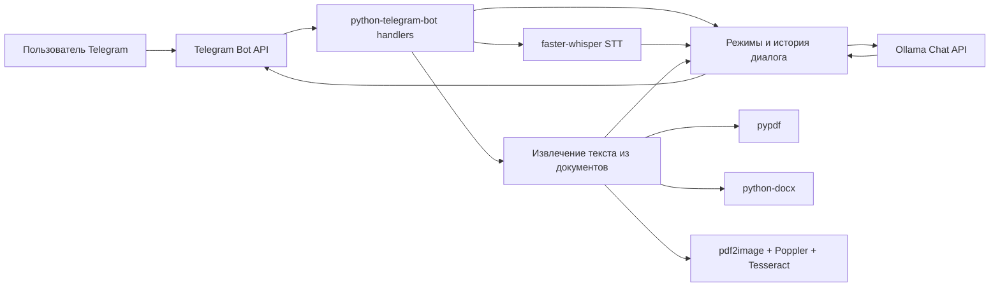

# Архитектура

## Назначение

Проект реализует персонального Telegram-ассистента, который работает поверх локальной Ollama-модели. Telegram используется как пользовательский интерфейс, а вся обработка текста, голоса и документов выполняется локально на машине, где запущен бот.

## Компоненты



## Точки входа

Основная точка входа - `main()` в [bot.py](../bot.py). Она:

- проверяет наличие `TELEGRAM_TOKEN`;
- печатает текущую конфигурацию;
- создает `Application` из `python-telegram-bot`;
- регистрирует command handlers и message handlers;
- запускает polling через `app.run_polling()`.

## Основной поток текстового запроса

1. Пользователь отправляет текст или команду.
2. Handler выбирает режим: `default`, `email`, `rewrite`, `shorten`, `vip`, `surf`, `shell`, `followup`.
3. `ask_ollama()` собирает сообщения:
   - system prompt режима;
   - последние элементы истории пользователя;
   - новый пользовательский текст.
4. Запрос уходит в `OLLAMA_URL` методом `POST`.
5. Ответ сохраняется в `USER_HISTORY` и отправляется пользователю.

История хранится в памяти:

```text
USER_HISTORY[user_id] = [
    {"role": "user", "content": "..."},
    {"role": "assistant", "content": "..."}
]
```

После каждого ответа история обрезается до `MAX_HISTORY_MESSAGES`.

## Голосовые сообщения

Поток `handle_voice()`:

1. Скачивает Telegram voice file во временную директорию.
2. Лениво загружает `WhisperModel` через `get_stt_model()`.
3. Распознает речь в `transcribe_audio_file()`.
4. Формирует отдельный prompt для режима `voice`.
5. Отправляет пользователю расшифровку и обработанный результат.

Модель STT хранится в глобальной переменной `STT_MODEL`, чтобы не загружать ее заново на каждое голосовое сообщение.

## Документы

Поток `handle_document()`:

1. Проверяет размер файла через `MAX_FILE_SIZE_MB`.
2. Проверяет расширение: `.txt`, `.md`, `.pdf`, `.docx`.
3. Скачивает файл во временную директорию.
4. Вызывает `extract_text_from_file()`.
5. Обрезает текст через `trim_document_text()`, если превышен `MAX_DOCUMENT_CHARS`.
6. Отправляет извлеченный текст в Ollama в режиме `document`.

Извлечение текста:

- `.txt`, `.md` - чтение с перебором кодировок `utf-8`, `utf-8-sig`, `cp1251`, `latin-1`.
- `.docx` - параграфы и таблицы через `python-docx`.
- `.pdf` - сначала прямое извлечение через `pypdf`; если текстовый слой пустой, OCR.
- OCR - рендер страниц через `pdf2image`, затем распознавание через `pytesseract`.

## Конфигурационная модель

Конфигурация читается из environment variables при импорте модуля. Значения не перечитываются во время работы процесса. После изменения `.env` или системного окружения нужно перезапустить бота.

## Границы ответственности

`bot.py` сейчас содержит все основные слои:

- конфигурация;
- system prompts и режимы;
- Ollama client;
- Telegram command handlers;
- STT;
- document parsing;
- OCR;
- runtime state.

Это удобно для быстрого прототипа, но при расширении проекта стоит разнести код на модули:

```text
app/config.py
app/prompts.py
app/llm.py
app/history.py
app/telegram_handlers.py
app/stt.py
app/documents.py
app/ocr.py
```

## Главные технические риски

- Нет контроля доступа по Telegram ID.
- История диалога не персистентна.
- Тяжелые операции OCR/STT выполняются внутри handlers и могут задерживать обработку.
- Нет тестов вокруг extraction, prompt routing и обработки ошибок.
- Ошибки внешних систем пробрасываются пользователю как есть.
- Нет graceful shutdown, health endpoint и метрик.
