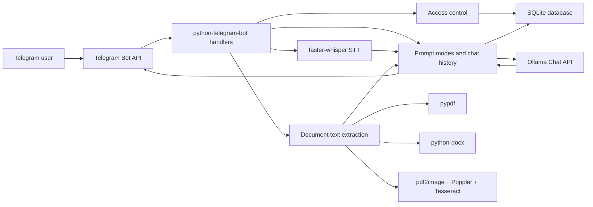
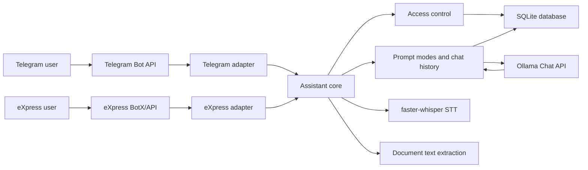

# Architecture

## Purpose

The project implements a local assistant with two layers: a general AI assistant for daily work and a specialized assistant for SURF Consulting's IT infrastructure pre-sales, tender analysis, delivery risk review, and business communication workflows. Telegram is the current user interface. eXpress is planned as the next corporate channel. Text generation, voice transcription, and document processing run locally on the machine that hosts the bot.

## Current Components



## Target Channel Architecture



The current implementation is still Telegram-first. Text messages and mode commands already pass through channel-neutral `AssistantRequest` and `AssistantResponse` models. The target design is a fuller channel adapter layer where Telegram and eXpress translate platform-specific events into internal assistant requests.

## Entry Point

The main entry point is `main()` in [bot.py](../bot.py). It:

- delegates to `app.main.main()`;
- validates that `TELEGRAM_TOKEN` is set;
- logs the current runtime configuration;
- creates a `python-telegram-bot` `Application`;
- registers command handlers and message handlers;
- starts polling with `app.run_polling()`.

## Module Layout

```text
bot.py
app/
  __init__.py
  access.py
  assistant.py
  config.py
  documents.py
  handlers.py
  history.py
  llm.py
  main.py
  prompts.py
  stt.py
  users.py
tests/
```

Responsibilities:

- `bot.py` - stable launchd-compatible entry point.
- `app/config.py` - environment parsing, typed settings, logging setup.
- `app/assistant.py` - channel-neutral request/response models and text request handling.
- `app/prompts.py` - system prompts and prompt modes.
- `app/access.py` - owner checks and access decisions.
- `app/history.py` - SQLite-backed conversation history repository.
- `app/users.py` - SQLite-backed managed user repository.
- `app/llm.py` - Ollama Chat API client and history orchestration.
- `app/stt.py` - `faster-whisper` model loading and transcription.
- `app/documents.py` - text extraction from TXT/MD/PDF/DOCX and OCR fallback.
- `app/handlers.py` - Telegram command and message handlers.
- `app/main.py` - application wiring and polling startup.

## Text Request Flow

1. The user sends a text message or command.
2. The channel handler selects a prompt mode: `default`, `audit`, `proposal`, `tender`, `vendor`, `risk`, `email`, `rewrite`, `shorten`, `vip`, `surf`, `shell`, or `followup`.
3. The channel handler builds an `AssistantRequest`.
4. `handle_text_request()` calls `ask_ollama()`.
5. `ask_ollama()` builds the LLM request:
   - the system prompt for the selected mode;
   - the user's recent history;
   - the new user message.
6. The request is sent to `OLLAMA_URL` with `POST`.
7. The response is stored in SQLite and sent back through the active channel.

History is stored in the SQLite database configured by `HISTORY_DB_PATH`:

```text
messages(id, user_id, role, content, created_at)
```

After each successful response, the user's persisted history is trimmed to `MAX_HISTORY_MESSAGES`.

## Access Request Flow

Owners are currently configured through `OWNER_TELEGRAM_USER_IDS`. The legacy `ALLOWED_TELEGRAM_USER_IDS` is still supported as a direct allowlist and as an owner fallback when no owners are configured. eXpress integration will require channel-neutral identities before production use.

Managed users are stored in the same SQLite database:

```text
users(
  user_id,
  username,
  full_name,
  role,
  status,
  created_at,
  updated_at,
  approved_at,
  approved_by,
  blocked_at,
  blocked_by
)
```

Flow:

1. An unknown Telegram user sends `/start` or `/request_access`.
2. The bot stores or refreshes a `pending` user row.
3. The bot sends owners a short approval message with `/approve <telegram_id>` and `/deny <telegram_id>`.
4. An owner approves, denies, revokes, or lists users through Telegram commands.
5. Active users can use normal bot commands; blocked and pending users cannot.

## Voice Messages

`handle_voice()` follows this flow:

1. Download the Telegram voice file into a temporary directory.
2. Lazily initialize `WhisperModel` through `get_stt_model()`.
3. Transcribe the audio in `transcribe_audio_file()`.
4. Build a dedicated prompt for the `voice` mode.
5. Send both the transcript and the processed summary back to the user.

The STT model is stored in the global `STT_MODEL` variable so it is not reloaded for every voice message.

## Documents

`handle_document()` follows this flow:

1. Validate file size with `MAX_FILE_SIZE_MB`.
2. Validate the extension: `.txt`, `.md`, `.pdf`, or `.docx`.
3. Download the file into a temporary directory.
4. Call `extract_text_from_file()`.
5. Trim extracted text with `trim_document_text()` if it exceeds `MAX_DOCUMENT_CHARS`.
6. Send the prepared text to Ollama using the `document` mode.

Text extraction strategy:

- `.txt`, `.md` - read with fallback encodings: `utf-8`, `utf-8-sig`, `cp1251`, `latin-1`.
- `.docx` - extract paragraphs and tables through `python-docx`.
- `.pdf` - first try direct extraction through `pypdf`; if the text layer is empty, run OCR.
- OCR - render pages through `pdf2image`, then recognize text with `pytesseract`.

## Configuration Model

Configuration is read from environment variables when the module is imported. Values are not reloaded while the process is running. After changing `.env` or shell environment variables, restart the bot.

## Responsibility Boundaries

The code now has a modular baseline and SQLite-backed short-term history. The next boundary worth extracting is heavy task execution, because OCR and STT still run directly inside Telegram handlers.

## Main Technical Risks

- Telegram user access control is disabled unless `OWNER_TELEGRAM_USER_IDS` or the legacy `ALLOWED_TELEGRAM_USER_IDS` is set.
- Conversation history is persistent, but there is no user-facing history inspection command yet.
- Heavy OCR/STT work is executed inside handlers and can delay processing.
- Test coverage is still helper-level and does not cover Telegram/Ollama integration.
- No graceful shutdown, health endpoint, or metrics.
