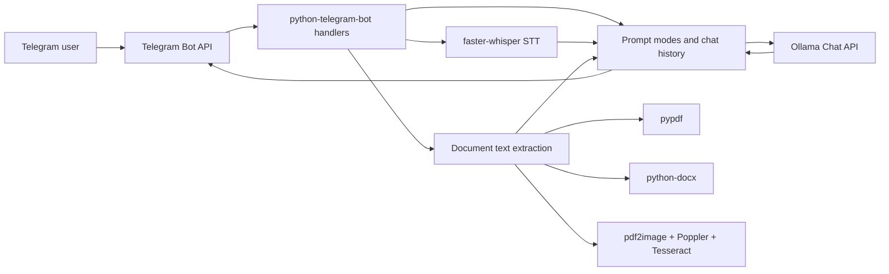

# Architecture

## Purpose

The project implements a personal Telegram assistant backed by a local Ollama model. Telegram provides the user interface, while text generation, voice transcription, and document processing run locally on the machine that hosts the bot.

## Components



## Entry Point

The main entry point is `main()` in [bot.py](../bot.py). It:

- validates that `TELEGRAM_TOKEN` is set;
- prints the current runtime configuration;
- creates a `python-telegram-bot` `Application`;
- registers command handlers and message handlers;
- starts polling with `app.run_polling()`.

## Text Request Flow

1. The user sends a text message or command.
2. The handler selects a prompt mode: `default`, `email`, `rewrite`, `shorten`, `vip`, `surf`, `shell`, or `followup`.
3. `ask_ollama()` builds the request:
   - the system prompt for the selected mode;
   - the user's recent history;
   - the new user message.
4. The request is sent to `OLLAMA_URL` with `POST`.
5. The response is stored in `USER_HISTORY` and sent back to Telegram.

History is stored in process memory:

```text
USER_HISTORY[user_id] = [
    {"role": "user", "content": "..."},
    {"role": "assistant", "content": "..."}
]
```

After each response, history is trimmed to `MAX_HISTORY_MESSAGES`.

## Voice Messages

`handle_voice()` follows this flow:

1. Download the Telegram voice file into a temporary directory.
2. Lazily initialize `WhisperModel` through `get_stt_model()`.
3. Transcribe the audio in `transcribe_audio_file()`.
4. Build a dedicated prompt for the `voice` mode.
5. Send both the transcript and the processed summary back to the user.

The STT model is stored in the global `STT_MODEL` variable so it is not reloaded for every voice message.

## Documents

`handle_document()` follows this flow:

1. Validate file size with `MAX_FILE_SIZE_MB`.
2. Validate the extension: `.txt`, `.md`, `.pdf`, or `.docx`.
3. Download the file into a temporary directory.
4. Call `extract_text_from_file()`.
5. Trim extracted text with `trim_document_text()` if it exceeds `MAX_DOCUMENT_CHARS`.
6. Send the prepared text to Ollama using the `document` mode.

Text extraction strategy:

- `.txt`, `.md` - read with fallback encodings: `utf-8`, `utf-8-sig`, `cp1251`, `latin-1`.
- `.docx` - extract paragraphs and tables through `python-docx`.
- `.pdf` - first try direct extraction through `pypdf`; if the text layer is empty, run OCR.
- OCR - render pages through `pdf2image`, then recognize text with `pytesseract`.

## Configuration Model

Configuration is read from environment variables when the module is imported. Values are not reloaded while the process is running. After changing `.env` or shell environment variables, restart the bot.

## Responsibility Boundaries

`bot.py` currently contains all main layers:

- configuration;
- system prompts and prompt modes;
- Ollama client;
- Telegram command handlers;
- STT;
- document parsing;
- OCR;
- runtime state.

This is convenient for a prototype, but the code should be split into modules as the project grows:

```text
app/config.py
app/prompts.py
app/llm.py
app/history.py
app/telegram_handlers.py
app/stt.py
app/documents.py
app/ocr.py
```

## Main Technical Risks

- No Telegram user access control.
- Conversation history is not persistent.
- Heavy OCR/STT work is executed inside handlers and can delay processing.
- No tests around extraction, prompt routing, or error handling.
- External errors are exposed to users directly.
- No graceful shutdown, health endpoint, or metrics.
